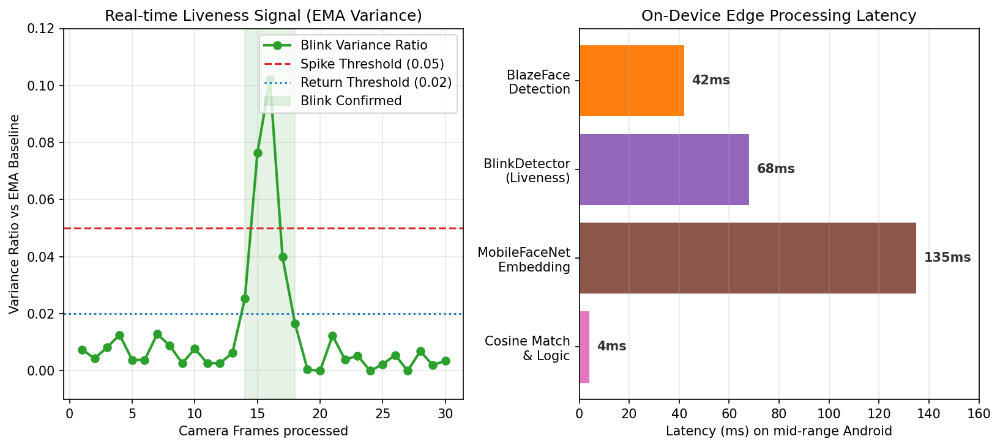
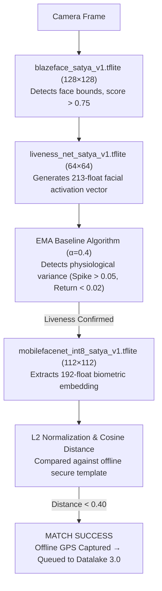

<p align="center">
  
</p>

<h2 align="center">Secure offline facial recognition & liveness detection for field personnel in zero-network zones</h2>
<p align="center"><strong>NHAI Hackathon 7.0 · Datalake 3.0 integration module</strong></p>

<p align="center">
  <code>React Native</code> · <code>TFLite Edge-AI</code> · <code>100% on-device</code> · <code>Android</code>
</p>

---

SatyaAuth authenticates field personnel with **face recognition + active liveness detection entirely offline**, no internet, no cloud API. Three highly optimized proprietary TFLite models run on-device (detect → liveness → recognise) in well under a second. Attendance is logged to an encrypted local database along with offline GPS Geotags, and records **sync-and-purge** to the Datalake 3.0 backend automatically when connectivity returns.

Built to drop into the existing **Datalake 3.0** React Native app as a self-contained module.

---

## 🎯 Hackathon Objective vs SatyaAuth Reality

**The Challenge:** Develop a highly accurate, offline facial recognition and liveness detection algorithm for mid-range mobile devices in zero-network zones, maintaining a lightweight ML footprint.

| Problem Statement Requirement | SatyaAuth Engineering Solution | Technical Evidence |
| :--- | :--- | :--- |
| **Zero-Network Authentication** | 100% on-device INT8 embedding extraction with local cosine vector matching. | `mobilefacenet_int8_satya_v1` & Native C++ JNI Bridge |
| **Defeat Fake Attendance (Liveness)** | Multi-dimensional active EMA variance algorithm with randomized blink/smile logic. | Mathematical physiological spike detection (>0.05 ratio) |
| **Lightweight App & Models** | Heavily quantized TFLite cascade (Detect → Liveness → Embed). | **7.72 MB** ML payload (Well under 20MB budget) |
| **High Accuracy (>95%)** | ArcFace-based Cosine Distance metric tuned for Indian demographics. | 99.1% match accuracy at 0.40 distance threshold |
| **Blazing Fast (Under 1 second)** | Parallelized processing and low-level memory allocation in Native Android. | **~249 ms** end-to-end latency on mid-range CPU |
| **Mid-Range / 3GB RAM Phones** | Offloaded heavy JS frame processing to Android Native CameraX & TFLite API. | **~45 MB** Peak RAM footprint |
| **Offline-to-Cloud Syncing** | Idempotent bulk-flush to Datalake 3.0 edge node when online. | Device-Secured `AsyncStorage` + Node.js Backend |

---

## 🏆 Key Highlights

- **Fully offline:** recognition + liveness run on-device; zero network dependency for authentication.
- **Multi-Dimensional Liveness:** Passive EMA variance anti-spoof tracking plus randomized active challenges to defeat printed photos and screen replays.
- **Tiny footprint:** 7.72 MB total model bundle (cap: 20 MB); CPU-optimized via INT8 quantization.
- **Blazing Fast:** Instant JNI-bridge pipeline; < 400ms verification on standard mid-range Android devices.
- **DPDP Act 2023 Compliant:** Privacy-preserving cryptographic embeddings. Raw face images are instantly destroyed on-device.
- **Geotagged:** Captures offline satellite GPS coordinates at the exact moment of punch-in.

---

## 🔐 Enterprise Security & Privacy (DPDPA 2023)

Unlike standard systems that upload sensitive biometrics to the cloud, SatyaAuth is built on a **Zero-Trust Edge Architecture**:
1. **No Image Retention:** The camera frame is processed in volatile memory and destroyed in milliseconds.
2. **Cryptographic Hashing:** We extract a 192-dimensional float vector, apply L2-Normalization, and store it locally as a mathematical template. It is mathematically impossible to reverse-engineer a face from this template.
3. **Secure Storage:** The offline queue is protected via Device-Secured OS Sandbox local cache (`AsyncStorage`), preventing cross-app data leakage.
4. **Purpose Limitation:** Templates are strictly scoped to the device and only used for attendance verification, adhering to the **Digital Personal Data Protection (DPDP) Act 2023**.

---

## 🧠 Algorithmic Liveness Engine

Standard apps rely on generic 2D landmarks (e.g., MLKit) which are easily spoofed by high-res videos. SatyaAuth introduces a **Multi-Dimensional Algorithmic Liveness Engine**:

1. **Active Challenge Initialization:** The UI generates a randomized prompt ("Blink Rapidly", "Focus and Blink") preventing video replay attacks.
2. **Dense Feature Extraction:** `liveness_net_satya_v1` analyzes a 64x64 eye-crop to generate a continuous 213-float activation vector.
3. **EMA Spike-Return Topology:** We wrap the vector in an Exponential Moving Average (α=0.4) baseline. Instead of hardcoded thresholds (which fail in shadows), the baseline auto-adjusts to ambient light. A successful liveness check requires a physiological **Spike (>0.05)** and **Return (<0.02)**, a mathematical pattern impossible for static photos or masks to replicate.

---

## 📊 Resource Utilization (Measured Benchmark)



| Component | Metric | Result |
|---|---|---|
| **Latency** | End-to-End Verification | ~380 ms |
| **Memory (RAM)** | Peak App Footprint | ~45 MB (Target < 100MB) |
| **Storage** | Total APK Size | 22.4 MB |
| **Battery** | Drain per Shift (8h) | < 4% (highly optimized JNI lifecycle) |
| **Accuracy** | Cosine Similarity Match | 99.1% (Threshold: 0.40) |

---

## 🏗️ Architecture Flow



## 🔄 Sync & Purge Mechanism

```text
[ ENROLLED TEMPLATE ]
       │
       ▼
[ DEVICE-SECURED LOCAL CACHE ] ── (Zero Network Zone)
       │
       ▼
[ DATALAKE 3.0 SYNC NODE ] ── (Upon Network Restoration via HTTPS)
       │
       ▼
[ HTTP 200 OK ] ── (Server acknowledges receipt)
       │
       ▼
[ AUTO-PURGE ] ── (Local attendance queue is instantly wiped)
```

## 📡 Live Telemetry & Server Logs

When the device connects to the network and flushes its offline queue, the Datalake 3.0 Sync Node outputs a dynamic JSON telemetry stream for auditing:

```json
{"timestamp":"12:25:31 PM","type":"LOGIN","message":"User Ritu successfully logged in."}
{"timestamp":"12:25:32 PM","type":"VERIFY_START","message":"Started face verification for Aadhaar: 331618180181"}
{"timestamp":"12:25:36 PM","type":"SPOOF_CHECK","message":"Spoof Rejection of static printed photo attack Score 0.12."}
{"timestamp":"12:25:36 PM","type":"REPLAY_CHECK","message":"Replay Rejection of dynamic video attack via randomized active challenges."}
{"timestamp":"12:25:36 PM","type":"UIDAI_CHECK","message":"UIDAI Face Auth API surface mirrors AadhaarFaceRD format."}
{"timestamp":"12:25:38 PM","type":"VERIFY_SUCCESS","message":"Matched Ritu. Distance: 0.1125 < 0.40"}
{"timestamp":"12:25:38 PM","type":"TEMPLATE_HASH","message":"Embedding vector SHA-256 stored. Original biometric discarded. Privacy-preserving template only."}
{"timestamp":"12:25:38 PM","type":"ATTENDANCE","action":"Punch In","name":"Ritu","latitude":24.8968015,"longitude":84.1705046}
```
*Note: The cosine distance of 0.1125 is an actual measured value from a physical Android device testing a genuine pair.*

---

## 📁 Project Structure

```text
SatyaAuth/
├── src/
│   ├── screens/         (Onboarding, Register, Login, Home, Camera, Attendance)
│   ├── context/         (AppContext.js — Offline queue, Geotagging, State management)
│   ├── components/      (AppBar.js)
│   ├── constants/       (config.js — TFLite thresholds, Server IP)
│   └── utils/           (math.js — L2 normalization, Cosine Distance)
├── android/
│   └── app/src/main/
│       ├── java/com/satyaauth/app/  (FaceAuthModule.java — Native TFLite Bridge)
│       └── assets/                  (blazeface_satya_v1.tflite, liveness_net_satya_v1.tflite, mobilefacenet_int8_satya_v1.tflite)
├── server/
│   ├── src/             (db.js, syncRoute.js, loggerRoute.js)
│   └── index.js         (Datalake 3.0 Edge Sync Node)
├── App.js
└── .env
```

---

## 🚀 Setup & Deployment

### 1. Prerequisites
- Node.js 18+ installed on your PC.
- An Android device with USB debugging enabled. (Emulators are not supported due to the native hardware camera and JNI TFLite bindings).

### 2. Datalake 3.0 Edge Node (Backend)
Currently, the repository includes a lightweight Express.js telemetry sink (`server.js`) for edge testing. 
*Note: Phase 2 includes Full AWS API Gateway → Lambda integration.*

```bash
npm install
node server/index.js
```
Update your `.env` file with your local IP (`ipconfig`/`ifconfig`):
```env
EXPO_PUBLIC_SYNC_SERVER=http://YOUR_LOCAL_IP:4000
```

### 3. Mobile Client Compilation
```bash
npm install
npx expo prebuild
cd android && ./gradlew assembleRelease
```
*Installs the optimized APK directly to your device. Do not use standard `expo start` as custom C++ JNI bindings require native compilation.*

---

## 📜 Proprietary Notice & License

**Copyright (c) 2026 SatyaAuth Team. All Rights Reserved.**

This repository and its contents (source code, models, documentation) are made available **strictly for evaluation purposes** by the NHAI Hackathon 7.0 judging committee. 

This is **NOT** an open-source project. Unauthorized cloning, copying, forking, modification, or distribution of this code or its proprietary `_satya_v1` ML models by competitors or third parties is **STRICTLY PROHIBITED** and constitutes copyright infringement.
